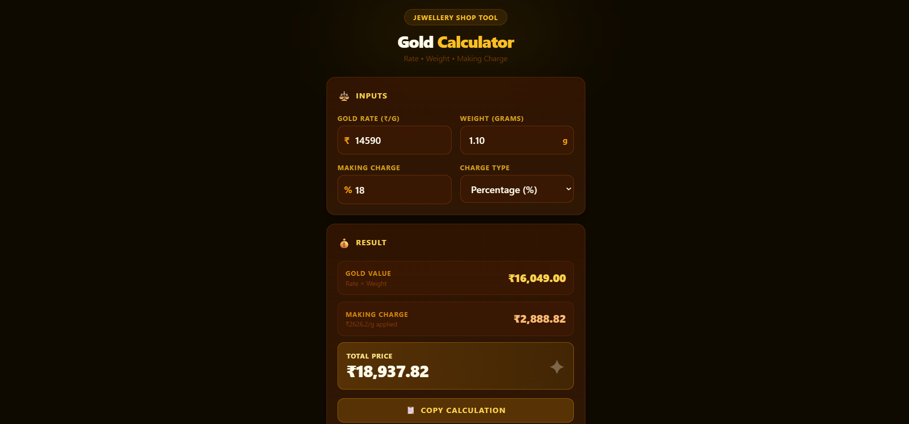

# 💰 Gold Calculator

A simple, fast, and practical **Gold Price Calculator** built using **React + Vite + TailwindCSS**.
This tool helps jewellery shops or individuals quickly calculate the price of gold based on **rate, weight, making charges, and traditional unit conversions**.

🌐 **Live App:** https://gold-calculator-ivory-five.vercel.app/

---

## ✨ Features

* ⚡ **Fast React UI** powered by Vite
* 📱 **Responsive design** for mobile and desktop
* 🧮 **Real-time price calculation**
* ⚖️ **Traditional unit conversions**

  * Ana
  * Paisa
  * Naya Bhadi
  * Purana Bhadi
* 💎 **Making charge calculation**
* 🔄 Instant updates when inputs change
* ☁️ Deployed and hosted on Vercel

---

## 🖥️ Tech Stack

* **React**
* **Vite**
* **Tailwind CSS**
* **JavaScript (ES6+)**

Deployment:

* **Vercel**

---

## 📂 Project Structure

```
gold-calculator
│
├── src
│   ├── components
│   │   └── UI components
│   │
│   ├── utils
│   │   ├── calculations.js
│   │   └── conversions.js
│   │
│   ├── App.jsx
│   ├── main.jsx
│   └── index.css
│
├── index.html
├── package.json
├── vite.config.js
└── tailwind.config.js
```

---

## ⚙️ Installation

Clone the repository

```
git clone https://github.com/Dev-aadi07/Gold-Calculator.git
```

Go to project directory

```
cd Gold-Calculator
```

Install dependencies

```
npm install
```

Run the development server

```
npm run dev
```

Open in browser

```
http://localhost:5173
```

---

## 🚀 Deployment

This project is deployed using **Vercel**.

Steps used for deployment:

1. Push project to GitHub
2. Import repository into Vercel
3. Select **Vite** as framework
4. Deploy

Vercel automatically runs:

```
npm run build
```

and serves the `dist` folder.

---

## 📸 Preview
 <!-- optional if you add one -->

Live preview:

https://gold-calculator-ivory-five.vercel.app/

---

## 🧠 Learning Goals

This project was built to practice:

* React component structure
* State management
* Utility-based architecture
* UI layout using TailwindCSS
* Real-world calculator logic
* Deployment workflow using GitHub + Vercel

---

## 🔮 Future Improvements

* 22K / 24K purity toggle
* GST calculation
* Result copy button
* WhatsApp share feature
* Save previous calculations
* Offline PWA support

---

## 👨‍💻 Author

**Adarsh Kumar Jha**

GitHub:
https://github.com/Dev-aadi07

---

⭐ If you found this project useful, consider giving it a star!
